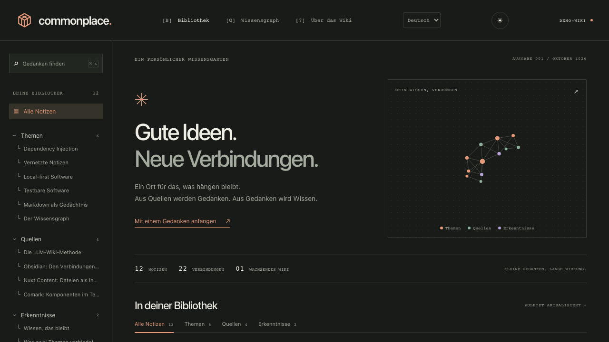

# Commonplace Wiki

[](https://github.com/alexanderop/commonplace-wiki/actions/workflows/ci.yml)
[](LICENSE)

Build your own local-first knowledge garden: Markdown in Git, connected notes, full-text search and an offline reading app.

**[Use this template](https://github.com/alexanderop/commonplace-wiki/generate)** to create an independent repository, then clone your copy and run the commands below. Choose a private repository if you intend to version personal material. A public repository exposes its committed source files even when the website excludes them.


A personal knowledge wiki with Markdown in Git, Nuxt Content collections, Comark components and an offline reading app. The design uses warm paper, terracotta accents and compact navigation inspired by claude.dev.



## Make it yours

1. Use the template button and clone your new repository.
2. Install dependencies and start the app with `pnpm install` and `pnpm dev`.
3. Replace the examples in `apps/wiki/content/public/` with your own Markdown. Keep links consistent; compilation rejects missing targets. An empty public collection also builds.
4. Adjust UI text and the default language in `apps/wiki/app/i18n/`, theme tokens in `packages/ui/src/styles/tokens.css`, and the app name/icons in `apps/wiki/nuxt.config.ts`, `WikiShell.vue` and `apps/wiki/public/`.
5. Update the repository links in this README, then run `pnpm verify` and `pnpm test:compat` before publishing.

The starter uses German and dark mode by default; English and light mode are available in the header. All included notes are examples. No API key or hosted database is required.

## Workspace

```text
apps/wiki/          Nuxt app, Markdown content, content compiler and static output
packages/ui/        Owned Vue components, Reka UI primitives and theme tokens
tests/              Executable Gherkin/Playwright app journeys
raw/                Immutable source inbox
docs/               Public activity log and project documentation
.agents/skills/     Wiki agent skills, playbooks and principles
```

Commands run from the workspace root. `@commonplace/wiki` consumes `@commonplace/ui` through `workspace:*`. The UI package is independent of Nuxt, content and translations. Component folders and public exports follow the organization used by shadcn-vue; implementations are owned here and use Reka UI directly. See [UI package](packages/ui/README.md) for its API. No shadcn-vue or React package is installed.

## Run the app

Use Node 24 and pnpm 10.

```sh
pnpm install
pnpm dev
```

Open http://127.0.0.1:3100. The development server does not enable offline caching.

To inspect the production app:

```sh
pnpm verify
pnpm preview
```

Open http://127.0.0.1:4173. Wait for “Offline verfügbar” before disconnecting. All selected notes and graph assets are cached. External links and videos still need a network connection.

## Add a note

Create a Markdown file directly inside `apps/wiki/content/public/` or `apps/wiki/content/private/`. A public file needs this frontmatter:

```yaml
---
noteId: your-note
title: Your note
description: One sentence about this idea.
kind: concept
updated: '2026-10-04'
tags: [Learning]
demo: false
---
```

Use `source`, `concept`, or `insight` for `kind`. The `noteId` determines the stable article URL. Link to other notes with `[Label](/notes/other-note)`. Ordinary links and source-reference components create graph edges and backlinks. Optional `relations` entries accept `target` and `kind`, with `links`, `builds-on`, or `contradicts` as kinds. The first graph displays connectivity rather than edge-kind labels.

Use `::insight{title="An observation"}` and `::source-reference{source="other-note"}` blocks for custom components. Both end with `::`. Do not use unsupported HTML or arbitrary Vue components.

Run `pnpm content` after changing notes. Restart `pnpm dev` or rebuild to load the new collection. Compilation fails on duplicate IDs, unsupported components and broken or unpublished references.

## Start with an empty wiki

```sh
pnpm content:reset                       # preview public content removal
pnpm content:reset --yes                 # delete all public content
pnpm content:reset --include-private --yes # delete public AND private content
```

This removes all files in the selected content directories except `.gitkeep`,
including your own notes, and clears generated collections, production output
and the content database cache. It preserves the app, `raw/`, activity logs and
Git history. Private notes are ignored by Git and may have no recoverable copy.
Stop the running server first; restart with `pnpm dev` or rebuild with
`pnpm build`. Browser offline copies remain until the site updates or its stored
data is cleared. The command does not commit, push or delete a deployed site.

## Keep private notes private

The default build reads only `apps/wiki/content/public`. `pnpm build:personal` includes `apps/wiki/content/private` too. That command replaces `apps/wiki/.output/public` with a personal edition. Never publish a personal build. Serve personal and public editions on different origins. Sharing a localhost link does not publish a page.

`pnpm verify` builds the public edition and scans all output files for the private test marker. CI copies a synthetic canary from `tests/fixtures/private-note.md` into the ignored private directory before building. Private notes and files in `raw/` are ignored by Git by default. Keep separate backups: ignored files are not saved in Git.

## Publish a static edition

```sh
pnpm verify
pnpm test:compat
```

Upload `apps/wiki/.output/public` to a static host. To build below a path, use `NUXT_APP_BASE_URL=/wiki/ pnpm verify` and the same environment for preview and tests. GitHub Pages deployment is included in `.github/workflows/ci.yml`. In your own
repository, open Settings → Pages and choose **GitHub Actions** as the source.
Push to `main` (or run CI manually on `main`): after both verification jobs pass,
a fresh checkout builds the public edition and deploys it. The repository base
path comes from GitHub Pages automatically, including root/custom-domain sites.
Synthetic test sources are used only in verification and never copied into the
deployment checkout. No API keys or extra deployment secrets are needed.

The reference site is https://alexanderop.github.io/commonplace-wiki/.
Update this link after creating your own template repository. Private content,
raw files and personal builds are never uploaded by the deployment job.

## Verify behavior

```sh
pnpm exec playwright install chromium firefox
pnpm test:compat
```

The default Gherkin suite works with your current notes, including an empty collection. It covers rendering, search, preferences, keyboard behavior and actual offline navigation. Every published page also receives axe accessibility audits and hydration checks across five reader profiles (fresh storage, saved dark/light themes, German/English, desktop/mobile). Search dialogs and mobile navigation are scanned too. See [the audit coverage and upstream research](docs/testing.md). `pnpm test:demo` also runs the original example-specific journeys when the starter notes are unchanged. These tests use the built production app. `pnpm verify` runs type checking, generation and output privacy checks.

## Content flow

Markdown files are the originals. The compiler parses them once with Comark and writes validated JSON records into an ignored directory. Nuxt Content queries those records. Articles, full-text search, headings and relationships all derive from the same Comark document. The browser renderer does not parse Markdown again.

The twelve public notes are examples, not a record of talks you watched. V1 is a reader. Browser editing, an in-browser LLM service and Git synchronization are not implemented. Repository-based agent workflows support capture and knowledge maintenance.

## Work with a coding agent

The entrypoint is [.agents/skills/wiki/SKILL.md](.agents/skills/wiki/SKILL.md). Ask your repository-aware agent: “Use the wiki skill to capture this YouTube URL privately,” “Read raw/my-talk.md and connect it to existing topics,” or “What do my notes say about dependency injection?” Agents with project skill discovery can select `wiki`; otherwise ask them to read that exact entrypoint. No global plugin or hook is installed.

The router selects YouTube, article, podcast, book, film, question or maintenance playbooks. Shared principles govern evidence, note reuse, meaningful connections and private-by-default capture. Source inspection reads authored Markdown and detects known duplicate URL variants; transcript acquisition uses available tools and reports missing evidence honestly.

Private notes and private activity (`raw/wiki-log.md`) stay ignored; only public changes go in `docs/wiki-log.md`. Review private files directly as well as the Git diff. Capturing a source does not authorize publication, commit or push. See [agent workflows and evaluation cases](docs/agent-workflows.md) for capabilities and limits.

Source notes may supply `sourceUrl` and `author`; the article renders an original-source link. To prepare a public edition, explicitly select the notes for `apps/wiki/content/public` and resolve their links before building.

## Appearance

Dark mode is the default. The sun/moon button in the header switches between dark and light. Your choice is saved locally in the browser and works offline.

## Interface languages

The interface supports German and English without an i18n dependency. The language selector saves your choice locally; Markdown notes keep their original text.

- Edit UI copy in `apps/wiki/app/i18n/de.ts` and `apps/wiki/app/i18n/en.ts`.
- Add a language by copying `en.ts`, translating its values, then registering the module in `messages` and its native label in `localeNames` in `apps/wiki/app/i18n/index.ts`.
- Change `defaultLocale` in that same file to change the initial language.
- Components use `t('key', { count: 3 })`. Keep the `{count}`-style placeholders when translating. The `satisfies` declaration checks that every key exists. Dates use the selected locale through native `Intl`.

This small layer handles literal text and named replacements; it does not interpret HTML, ICU messages or automatically translate content. The initial static HTML uses the default language, then restores a saved preference after hydration.

## Resource types

A source note (`kind: source`) can set `resourceType` to `blog`, `youtube`, `podcast`, `film`, `book`, `documentation` or `other`. The library shows translated resource labels and filters with counts. Sources without a type fall back to `other`; topics and insights do not have resource types. Empty categories stay available so you can see which kinds of sources are still missing.

```yaml
kind: source
resourceType: youtube
sourceUrl: https://www.youtube.com/watch?v=YOUR_VIDEO_ID
```

This classifies a resource; it does not claim you watched it or automatically import its contents. The starter documentation sources are classified honestly, and the video/podcast/film/book categories start empty.

## License

MIT; see [LICENSE](LICENSE). The license covers this template code and original sample notes. You are responsible for rights to sources you add.

### Authors

Source notes can link to an author overview. Add `author: Ursula K. Le Guin`
and optionally `authorId: ursula-le-guin` and `authorUrl: https://www.ursulakleguin.com/`
to Markdown frontmatter. Use the same name and ID across that author's resources.
An explicit stable ID keeps links unchanged when a display name changes and
separates different people with the same name. Without an ID, a slug is derived
from the name; names without Latin letters need an explicit ID. Conflicting
names or profile URLs under one ID fail compilation. Do not invent an author
when attribution is unknown. Organizations can also be credited as authors.

`/authors` lists authors; `/authors/<id>` groups their source notes. These pages,
resource counts, search and offline output are derived only from the selected
publication audience. No separate author index needs to be maintained.

### Multiple contributors

A source may credit several people or organizations. Roles belong to each source,
so the same person can be an author of a book and a guest on a podcast:

```yaml
contributors:
  - id: jane-doe
    name: Jane Doe
    roles: [host, editor]
    url: https://example.com/jane
  - id: sam-example
    name: Sam Example
    roles: [guest]
```

Supported roles: `author`, `host`, `guest`, `editor`, `translator`, `director`,
`speaker`, `organization`. Omitted roles default to `author`. Reuse stable IDs
across resources; namesakes need distinct IDs. One entry per contributor per
source, with multiple roles if needed. Each resource is counted once on each
contributor's overview. The existing `author`/`authorId`/`authorUrl` format still
works. Do not mix it with a nonempty `contributors` list. Missing credits remain
unknown; do not invent them. Website URLs and names for one ID must be consistent.

CI adds the fictional sources in `tests/fixtures/contributors/` to exercise
coauthors, multiple roles, namesakes, navigation and offline author pages. They
are not part of the template's authored content.
